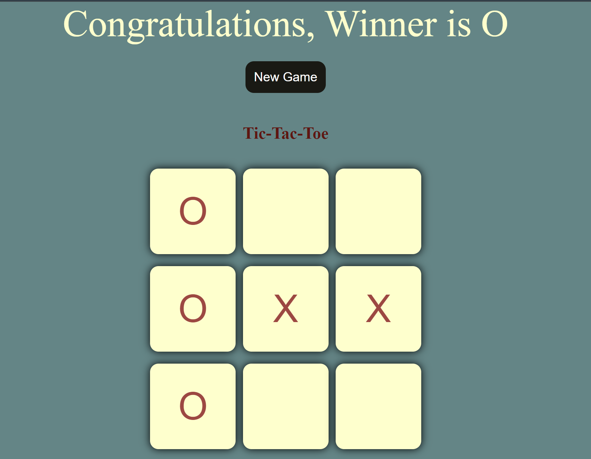
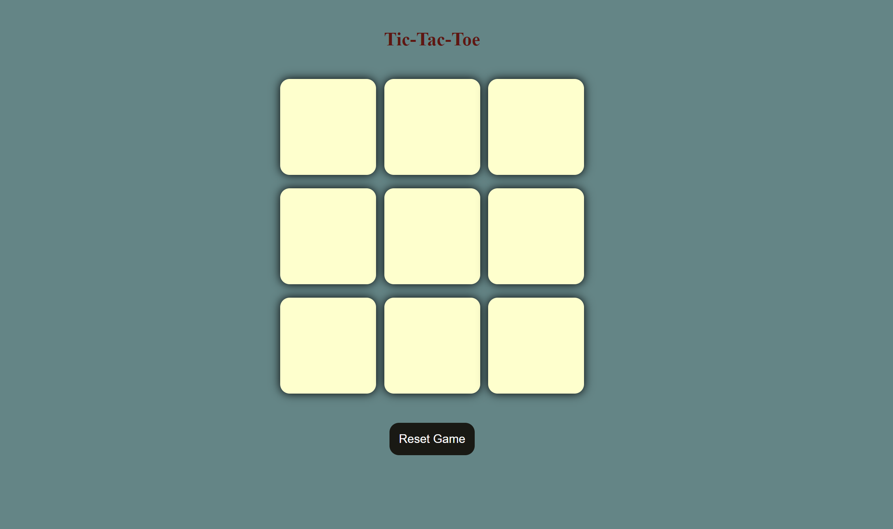

# tic-tac-toe-game
A simple Tic-Tac-Toe game built using HTML, CSS, and JavaScript. Features a user-friendly interface with interactive gameplay. Playable for two players on the same device.

# Tic-Tac-Toe Game

A simple, responsive Tic-Tac-Toe game built with HTML, CSS, and JavaScript. This project is designed for two players and provides a user-friendly interface with interactive gameplay.

## Features

- **Two-player mode**: Play against a friend on the same device.
- **Responsive design**: The game board adapts to different screen sizes.
- **Game reset**: Easily reset the game or start a new game using buttons.
- **Winner announcement**: Displays a message when a player wins.
- **Smooth hover effects**: Highlighting each cell when hovered.

## Preview




## How to Play

1. The game begins with player **O** making the first move.
2. Players take turns selecting any available box on the 3x3 grid.
3. The first player to align three of their marks (O or X) in a row, column, or diagonal wins the game.
4. Once a player wins, the game will announce the winner.
5. You can reset the game anytime using the **Reset Game** button.

## Files

- **index.html**: The main HTML file containing the game structure.
- **style.css**: The CSS file for styling the game board.
- **logic.js**: The JavaScript file containing the game logic.

## How to Run the Game

1. Clone the repository:
   ```bash
   git clone https://github.com/Anush-2024/tic-tac-toe-game.git 
